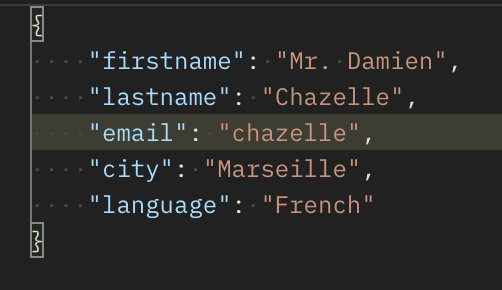
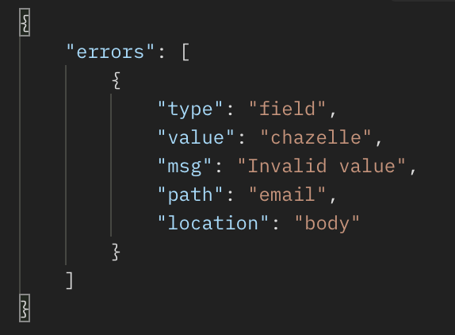

# Using MySQL Database with Express.JS to make an API

This project is using a test MySQL DB to return results of Movies / Users (based on query)

### How to Use
1. Clone this Repo
2. Create a MySQL database and source the SQL file 'express_quests.sql'
3. Create a .env file in the root
4. Use the data from ENV Sample file and use your DB Credentials to connect
5. npm run dev

### GET ROUTES

#### Query Movies
```
http://localhost:5000/api/movies
```

#### Query Movie by ID
```
http://localhost:5000/api/movie/{id}
```

#### Query Users
```
http://localhost:5000/api/users
```

#### Query Users by ID
```
http://localhost:5000/api/user/{id}
```

### POST Routes (Postman Only)
#### Add Movie

###### Data Needed
```JSON
{
 title: "Movie Title",
 director: "Director",
 year: "Year",
 color: "1", // 1 for color movie, 0 for black/white movie
 duration: 180
}
```
```
http://localhost:5000/api/movies
```

#### Add User
###### Data Needed
```JSON
{
 firstname: "First Name",
 lastname: "Last Name",
 email: "someone@example.com",
 city: "Madrid",
 language: "Valyrian"
}
```
```
http://localhost:5000/api/users
```

### PUT Routes (Postman Only)

#### Update Movie

###### Data Needed

```json
{
 title: "Update Movie Title",
 director: "Update Director",
 year: "Update Year",
 color: "Update 1", // 1 for color movie, 0 for black/white movie
 duration: 180
}
```

```
http://localhost:5000/api/movies/{id}
```

#### Update User

###### Data Needed

```json
{
 firstname: "First Name",
 lastname: "Last Name",
 email: "someone@example.com",
 city: "Madrid",
 language: "Valyrian"
}
```

```json
http://localhost:5000/api/users/{id}
```

### Validations (Postman Only)

Validating User Input (through sending data via postman, no HTML forms yet) before adding data to the DB. The validations are being checked by `express-validtor`

| Error Input                  | Error Output                  |
| ---------------------------- | ----------------------------- |
| Wrongly inputted email ID    | Error output                  |
|  |  |

### Delete Routes (Postman Only)

#### Delete Movie

```
http://localhost:5000/api/movies/{id}
```

#### Delete User

```
http://localhost:5000/api/users/{id}
```

### Query Parameters

#### Movie Queries

`color` and `duration`

```
http://localhost:5000/api/movies?color={} // Pass 0 or 1
```

```
http://localhost:5000/api/movies?duration={} // Duration in minutes
```

#### User Queries

`language` and `city`

```
http://localhost:5000/api/movies?city={} // Example Paris
```

```
http://localhost:5000/api/movies?language={} // Example English
```

